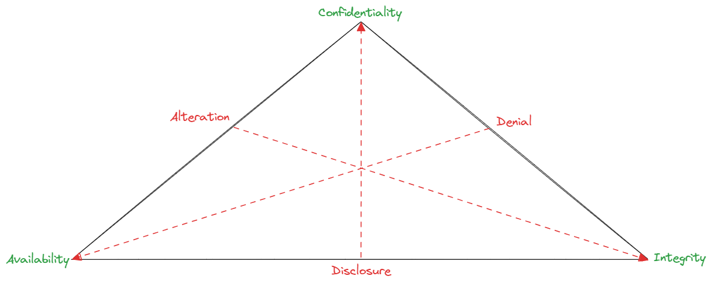
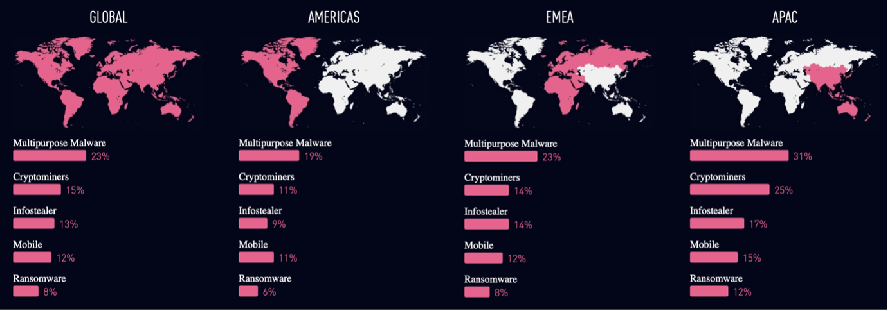
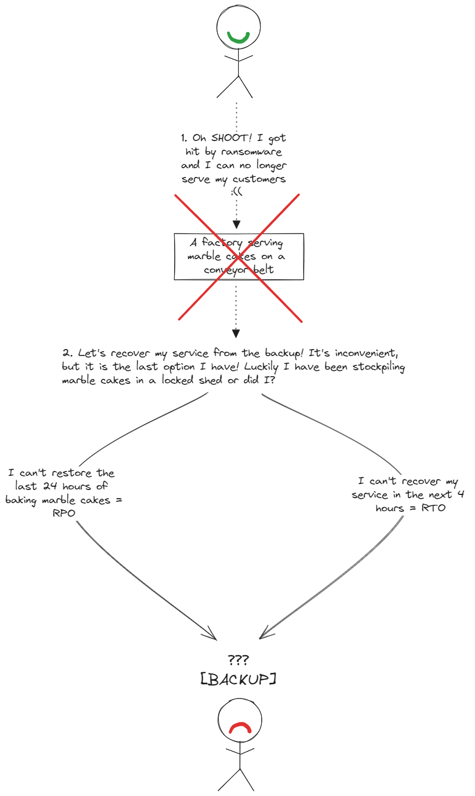
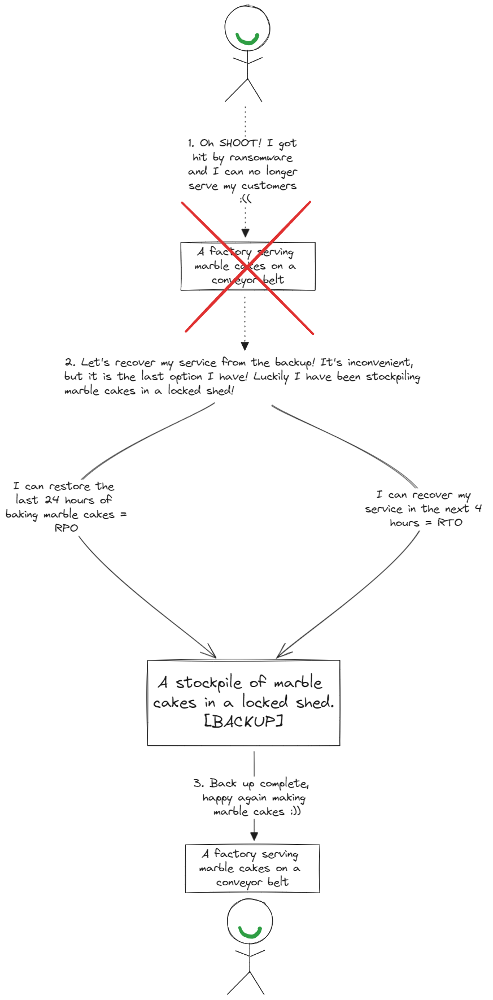
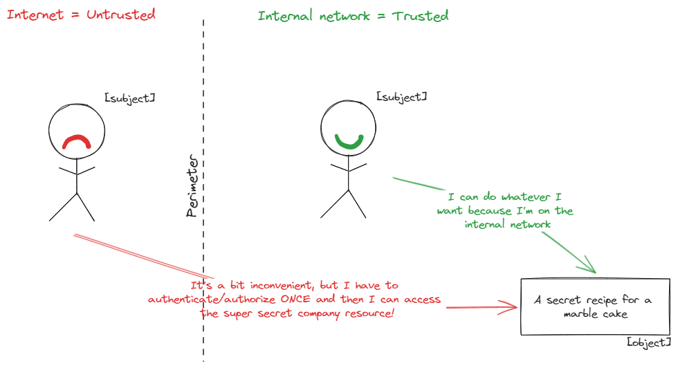
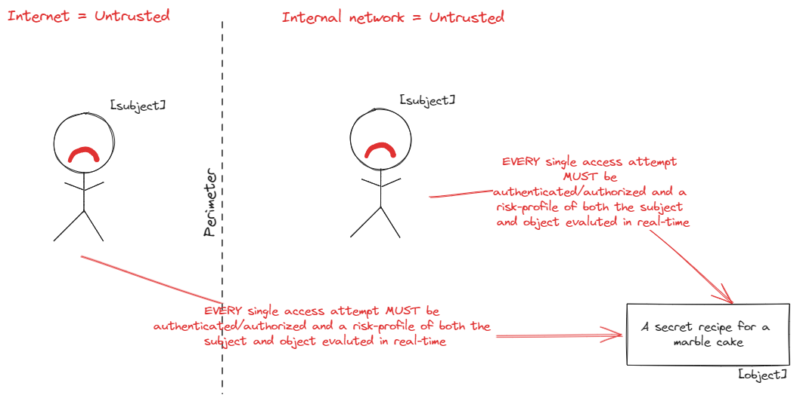
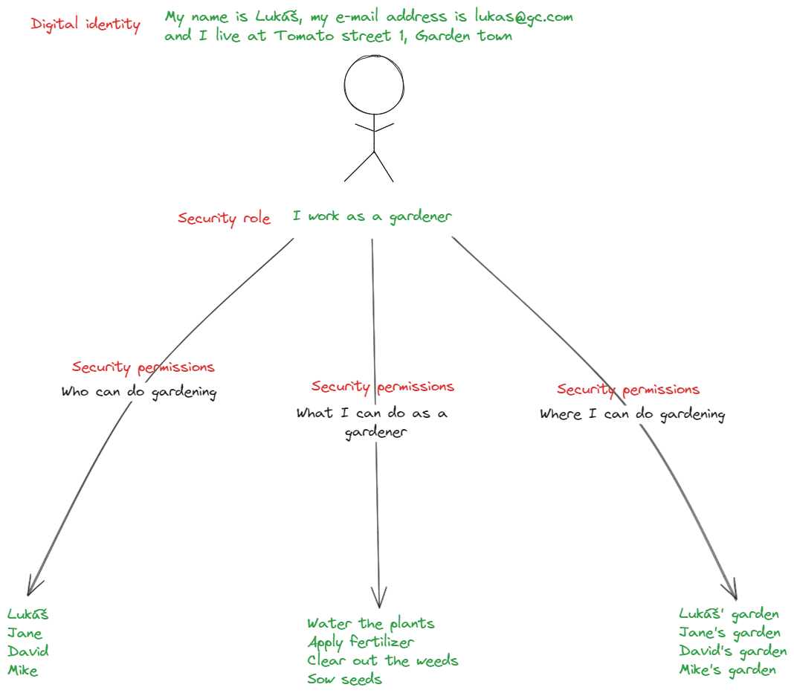
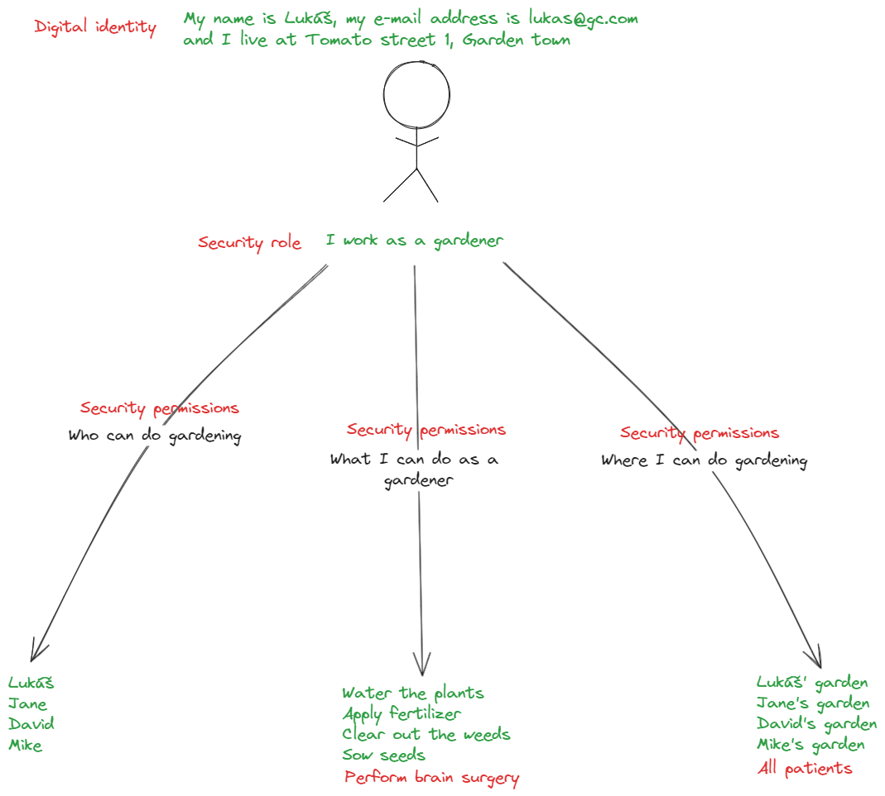

# Ransomware
Welcome dear readers, I've decided to write a short article on the topic of ransomware.

I will describe ransomware, what are the basic components of ransomware, what are the risks of ransomware and how to protect against and mitigate the impact of ransomware. It's by no means full and exhaustive description of ransomware, but it highlights the most relevant areas where an enterprise MUST take action.

Enjoy the reading!

## Definition of ransomware
A malware (from the words **mal**icious soft**ware**) is a piece of software that performs some kind of malicious activity (e.g., deleting files, recording user activity, encrypting and exfiltrating data). There are many categories of malware such as spyware, trojan, worm, cryptojacking malware, rootkit, keylogger and ransomware.

**“Ransomware is a category of malware, more specifically a piece of malicious software that uses cryptography to deny access to data.”**

However, because the ransomware has been evolving over the past 30 years or so to combine business and technology, a more accurate definition of ransomware would be,

**“Ransomware is an extortionist business model designed to deny access to data until the cybercriminals’ demands are met.”**

The modern ransomware business model consists of a lot of moving parts, but it fundamentally builds on the following core components – **Cryptography**, **Cryptocurrency** and **Overlay networks**.

<table align="center">
    <tr><td><b>
Cryptography
</b></td><td><b>
Cryptocurrency
</b></td><td><b>
Overlay networks
</b></td></tr>
    <tr><td></td><td></td><td></td></tr>
</table>

## Cryptography
Ransomware uses **cryptography** to compromise the availability (and potentially confidentiality) of data. It is **cryptography** that provides cybercriminals the leverage to demand a ransom in exchange for the stolen data.

However, because there is no honor among thieves even if the enterprise would decide to pay the ransom there is no guarantee that,

-	The cybercriminals would return 100% of the stolen data
-	The cybercriminals would return unmodified data with no embedded malware
-	The cybercriminals would still not sell the stolen data to the highest bidder

**Cryptography** represents the methods of **how ransomware compromises the availability and confidentiality of data.**

## Cryptocurrency
**Cryptocurrencies** are the digital equivalent of money and precious metals. Cybercriminals use **cryptocurrencies** (e.g., Bitcoin, Monero, Zcash) for the following reasons,

-	Anonymity
-	No central oversight or regulation
-	High speed
-	Ease of access

**Cryptocurrencies** represent the methods of **how ransomware extorts the enterprise and how the ransom is transferred to the cybercriminals in exchange for stolen data.**

## Overlay networks
**Overlay networks** are computer networks built on top of other networks (e.g., in the beginning of the Internet, the Internet was built as an overlay network on top of the public telephone network). In the context of ransomware, the most widely known **overlay network is TOR (The Onion Router).** Ransomware uses **overlay networks** for several reasons,

-	To privately and anonymously interact with the enterprise
-	To coordinate the attack with other cybercriminal groups
-	To exfiltrate the stolen data

**Overlay networks** represent the methods of **hiding the ransomware attack, making it difficult to detect it and how the ransomware communicates with and receives orders from the cybercriminals.**

# The risks of ransomware
Let’s start with the basics, the following image represents the fundamental <b>security goals</b> (in green) and the corresponding <b>security risks</b> (in red) as represented by the CIA and DDA triads.

The **security goals** are,

**Confidentiality** – protecting data from unauthorized **disclosure** = protecting the value of data. 
**Integrity** – protecting data from unauthorized **alteration** = protecting accuracy and correctness of data. 
**Availability** – protecting data from **denial** and **destruction** = protecting redundant and timely access to data. 

The **security risks** are,

**Disclosure** – results in the loss of confidentiality of data = **disclosure** compromises **confidentiality** 
**Denial** – results in the loss of availability = **denial** compromises **availability** 
**Alteration** – results in the loss of integrity of data = **alteration** compromises **integrity** 

There are two main risks of ransomware,

-	**Compromise of the availability and confidentiality of data** - A successful ransomware attack **ALWAYS** compromises the availability of data. If the confidentiality of the data is inadequately protected prior to ransomware attack, then the ransomware will also additionally compromise the confidentiality of data.
-	**Data exfiltration** – The ransomware will attempt to exfiltrate the compromised data away from under the control of the enterprise to under the control of the cybercriminals giving the latter the leverage to extort the victim – typically money in exchange for data. The impact of this risk is further compounded by the sensitivity of the compromised data, the value of the compromised data, exposure of intellectual property to unauthorized parties and various financial penalties and reputational damages stemming from the loss of control over the compromised data.

As far as the categories of malware go, ransomware is statistically one of the least frequent categories of malware in the wild therefore the risk of infection by ransomware is relatively low, however the risk of infection by ransomware also largely depends on several factors, such as,

-	In what geographical location(s) does the enterprise do business?
-	What are the specific risks in the industry where the enteprise does business?
-	With whom does the enterprise do business?
-	What is the maturity of the enterprise’s cybersecurity strategy?
-	What operating system does the enterprise use?
-	What is the level of employee awareness about risks and threats?

and the most important factor of them all, **if someone is out there to get you, they will get you, it is only a matter of time**, the important thing is slowing down the propagation and containing the impact of ransomware as much as possible for as long as possible. It is also important to mention that ransomware is typically a part of a larger attack campaign, therefore being compromised by ransomware means there is more going on than just ransomware.

<table align="center" border=0>
    <tr><td></td></tr>
    <tr><td><b>
The global and regional statistics of malware infection rates (Checkpoint 2023)
</b></td></tr>
</table>

The main reason why ransomware, despite its very low infection rate, makes headlines in the media is because of how risk is calculated,

<b>Risk = Probability x Impact</b>

While the probability of infection by ransomware is **LOW**, the impact, whether financial, loss of customer credibility and reputation, disclosure of intellectual property is **VERY HIGH**.

# Protecting and mitigating the impact of ransomware
The following are the top 5 categories of vulnerabilities that are exploited by malware,

-	Unpatched vulnerabilities
-	Security misconfiguration
-	Compromised identity
-	Social engineering
-	Insider threat

To protect against ransomware, the enterprise MUST have at least the following risk controls in place,

## Data governance
Before the enterprise can protect data against ransomware, it has to know what data it has and how valuable the data are in order to apply appropriate risk controls relative to their value.

The goal of **data governance** is to build trust in the data by enforcing processes and risk controls to the data lifecycle. **Data governance** answers the questions,

-   Where does the data come from?
-   Who is the owner of the data?
-   How does the data move across the enterprise?
-   How does the data change as it travels across the enterprise?
-   How valuable are the data?
-   What risk controls are applied to the data?
-   What risk does the enterprise take by making a business decision or prediction based on specific data?

**When the enterprise adopts data governance it is moving from handling data as uncertainty to handling data as risk, a risk that is identifiable, measurable, quantifiable and can be mitigated by applying appropriate risk controls.**

<table align="center" border=0>
    <tr><td></td><td></td></tr>
    <tr><td><b>
An enterprise WITHOUT data governance
</b></td><td><b>
An enterprise WITH data governance
</b></td></tr>
</table>

In a library **WITHOUT** book governance where the books are kept in a disorganized heap there is no way of knowing how many books there are, to find a specific book in that heap takes a long time, if somebody steals a book there is no way of knowing who did it and which book was taken and there is also a high chance that this kind of disorganized library will have neither security cameras nor a librarian to enforce order and security.
  
In a library **WITH** book governance, the books are organized in a bookcase, put on a shelf, sorted by author, alphabetically or by genre, if anybody wants a specific book, say by Ernst Hemingway or Dante Alighieri they can just go to a shelf marked H or A and find it quickly, if anybody steals a book it will be readily apparent by an empty space on the shelf and by a recording from the security cameras, the librarian can also provide additional information as to the history of borrowing and returning of any book in the library.
  
The enterprise MUST have a **data governance** framework in place, because when the ransomware hits, the enterprise has a way of identifying what data were affected, what is the impact and what risk controls are in place.

## Backup and restore strategy
After the ransomware has compromised the availability (and potentially confidentiality) of data it will come after the enterprise’s backup infrastructure to further cripple the enterprise’s ability to quickly recover to the last known healthy state (i.e., the compromise of RPO and RTO).

<table align="center" border=0>
    <tr><td></td></tr>
    <tr><td><b>
An enterprise WITHOUT a backup and recovery strategy
</b></td></tr>
</table>

The enterprise must have a well-established backup and recovery strategy, it means not only must the enterprise periodically back up its data, but it must also periodically verify that the recovery from backups work.

<table align="center" border=0>
    <tr><td></td></tr>
    <tr><td><b>
An enterprise WITH a backup and recovery strategy
</b></td></tr>
</table>

**The backups must also be stored in a location not accessible to the ransomware (preferably offline).**

## People awareness
**The weakest link in the chain of risk controls has always been the people.** People are susceptible to a number of emotions – stress, fear, frustration – therefore, it stands to reason that the most common way for ransomware to gain access to enterprise‘s data is through social engineering (exploiting human emotions).

The enterprise MUST have a well-established security awareness program, it must constantly educate its employees as to the latest risks and threats – what should people pay attention to, what should raise a red flag, how to correctly use the risk controls available to them, who to contact and frequently conduct internal simulated phishing campaigns to keep people aware and alert.

## Endpoint security and threat intelligence
Because people are the primary target for ransomware, it is only logical that the endpoint devices that people use (e.g., laptops, tablets, smart devices, smartphones) are the primary entry point to the enterprise‘s data.

To protect against ransomware the enterprise MUST be able to identify it. The ransomware has behavioral patterns – it creates/deletes files, it establishes network connections, it exploits specific vulnerabilities, it moves hierarchically or laterally across the infrastructure, it exfiltrates data through specific channels – and the threat actors (cybercriminals) operate in specific regions, target specific industries and have specific intentions and motives, all these attributes combined make up the **threat intelligence.**

The enterprise MUST secure **endpoint devices** by deploying endpoint risk controls (e.g., XDR, EDR, NDR, AV) and integrate these risk controls with multiple reputable and up-to-date sources of **threat intelligence.**

## Defense in depth and zero trust
Because ransomware and threat actors are constantly evolving, so must the security architecture. By following the principles of **defense in depth**, the enterprise is not relying on any one vendor, and it is implementing multiple layers of overlapping risk controls to stop or slow down ransomware from propagating.

<table align="center" border=0>
    <tr><td></td></tr>
    <tr><td><b>
A simplified perimeter-based architecture
</b></td></tr>
</table>

The **zero trust architecture** is a risk-centric and identity-centric approach to security architecture that is based on no implicit trust and implicit assumption of breach. There is no more untrusted Internet and trusted internal network, everything is equally untrusted, and every single access attempt needs to be authenticated and authorized based on the risk-profile of both the subject (the entity accessing) and object (the entity being accessed).

<table align="center" border=0>
    <tr><td></td></tr>
    <tr><td><b>
A simplified zero trust architecture
</b></td></tr>
</table>

The enterprise MUST design the security architecture in such a way to assume that ransomware is already present on the internal network and that when it "detonates" its impact will be as minimal as possible.

## Security posture management
The **security posture management** is a tool to continuously check the compliance of monitored assets. It makes sure that the monitored assets are configured correctly, that they are patched to the latest patch level and that they are in compliance with the enterprise’s security configuration baseline.

In the context of **security posture management** the compliance and baseline configuration are enforced through the concept of **Infrastructure as Code (IaC)** where the baseline configuration is monitored, stored and managed as a file and deployed automatically and consistently to all monitored assets as opposed to manually and individually by human operators which typically increases the risk of a human failure.

The enterprise MUST have a **security posture management** to mitigate the risk of ransomware exploiting **unpatched vulnerabilities** and **security misconfigurations** in the monitored assets.

## Identity and Access Management
A modern security architecture requires strong digital identity practices. A digital identity is associated with a security role, which is a combination of who can do what and where. 

<table align="center" border=0>
    <tr><td></td></tr>
    <tr><td><b>
A correctly permissioned digital identity
</b></td></tr>
</table>

**For ransomware to carry out its malicious activity it requires a compromised digital identity (typically overpermissioned) and the ability to execute code.**

<table align="center" border=0>
    <tr><td></td></tr>
    <tr><td><b>
An overpermissioned digital identity
</b></td></tr>
</table>

The enterprise MUST establish a robust IAM framework, ensure that no digital identity is over permissioned (i.e., apply the principle of least privilege) and monitor the behavioral patterns of digital identities for anomalous activity.

## Cryptographic key management
If ransomware shows us anything, then it is that,

-   Cryptography works
-   Without the cryptographic key, the encrypted data is unrecoverable
-   By ownership of the cryptographic key used to encrypt the stolen data the cybercriminals have a leverage over the enterprise to extort a ransom in exchange for the stolen data

**A simple truth with cryptography is that deploying cryptography without proper cryptographic key management provides a false sense of security, results in a defective risk control and significantly increases the chance of a data breach.**

The enterprise MUST implement strong cryptographic controls including cryptographic key management to reduce the risk of compromise of data confidentiality and data privacy and therefore non-compliance with data protection and privacy laws.

# Conclusion
In summary, it is important to realize that ransomware is no longer just a piece of malicious software, it is an extortionist business model coordinated by multiple groups of cybercriminals. It is also worth to note that ransomware is typically part of a larger attack campaign.

With the recent developments in “artificial intelligence”, the authenticity of phishing campaigns will increase and so will the danger to the end users.

Despite all the technology, it ultimately all comes down to a social engineering attack against a human being that succeeds (e.g., a user clicks a link in an e-mail or unwittingly approves multi-factor authentication prompt). The enterprise must invest effort and time to educate its employees as to the latest cybersecurity threats and how to use the risk controls available to them.